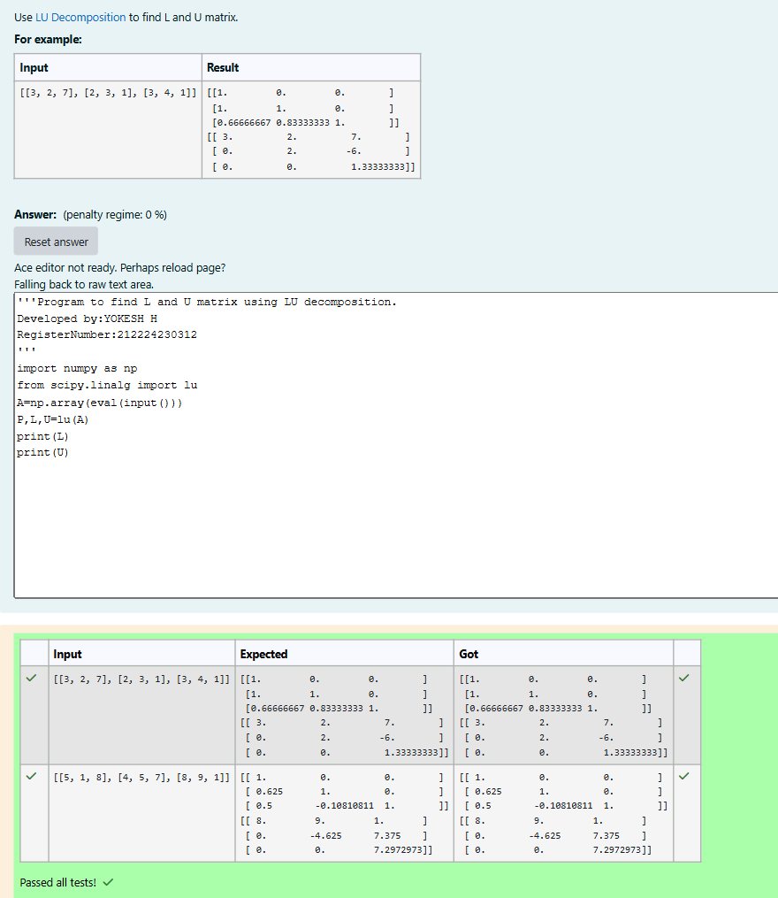
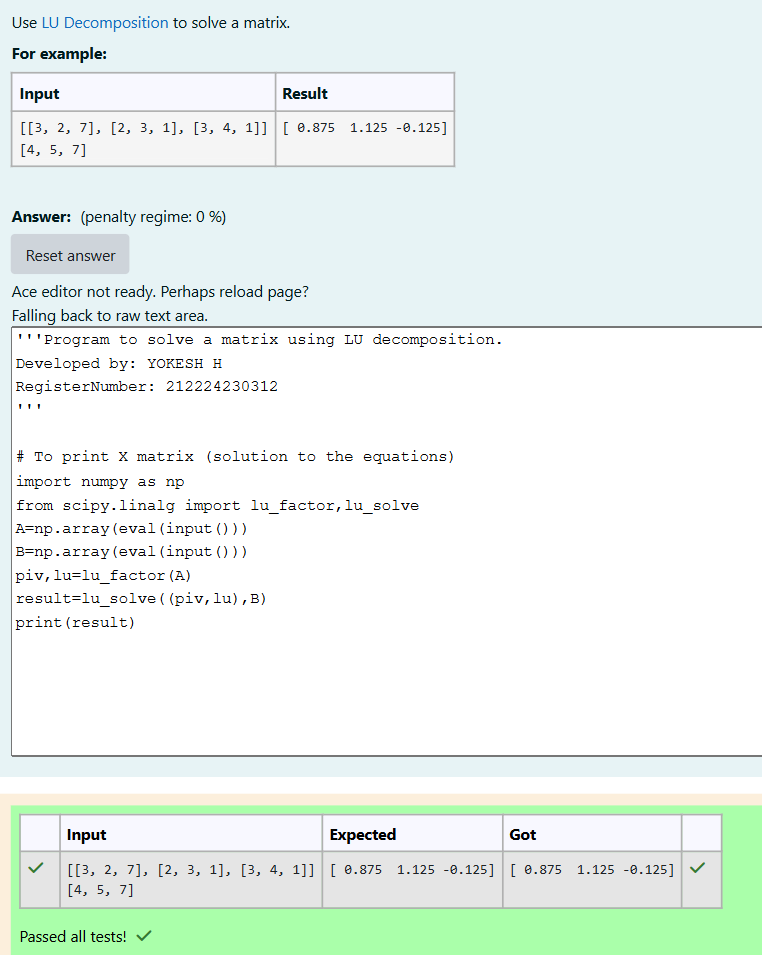

# LU Decomposition 

## AIM:
To write a program to find the LU Decomposition of a matrix.

## Equipments Required:
1. Hardware – PCs
2. Anaconda – Python 3.7 Installation / Moodle-Code Runner

## Algorithm
(i) To find the L and U matrix
1. Import NumPy and lu from scipy.linalg.
2. Read matrix input from the user using input() and convert it into a NumPy array.
3. Perform LU decomposition using lu() function and store the result in P, L, U.
4. Print the lower triangular matrix L.
5. Print the upper triangular matrix U.

(ii) To find the LU Decomposition of a matrix
1. Import NumPy and the functions lu_factor and lu_solve from scipy.linalg.
2. Read matrix A (coefficient matrix) from the user and convert it into a NumPy array.
3. Read matrix or vector B (right-hand side of the equation Ax = B) from the user and convert it into a NumPy array.
4. Perform LU factorization of matrix A using lu_factor(A).This returns lu (combined LU decomposition) and piv (pivot indices).
5. Solve the linear system using lu_solve((piv, lu), B) and store the result.
6. Print the solution vector or matrix.

## Program:
(i) To find the L and U matrix
```
'''Program to find L and U matrix using LU decomposition.
Developed by: Yokesh H
RegisterNumber: 212224230312
'''
import numpy as np 
from scipy.linalg import lu
A=np.array(eval(input()))
P,L,U=lu(A)
print(L)
print(U)
```
(ii) To find the LU Decomposition of a matrix
```
'''Program to solve a matrix using LU decomposition.
Developed by: Yokesh H
RegisterNumber: 212224230312
'''

# To print X matrix (solution to the equations)
import numpy as np
from scipy.linalg import lu_factor,lu_solve
A=np.array(eval(input()))
B=np.array(eval(input()))
piv,lu=lu_factor(A)
result=lu_solve((piv,lu),B)
print(result)
```

## Output:





## Result:
Thus the program to find the LU Decomposition of a matrix is written and verified using python programming.

